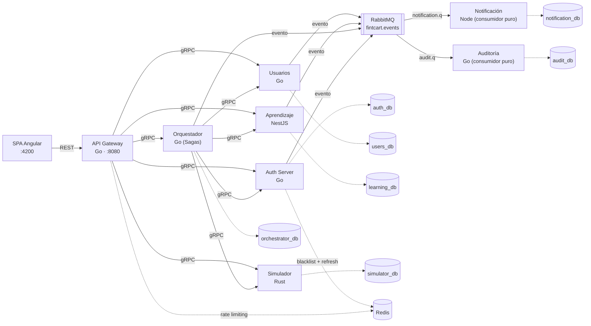

# Fintcart

> Plataforma de educación financiera interactiva para el mercado colombiano: contenido curado, simuladores financieros con precisión decimal arbitraria y seguimiento de progreso, sobre microservicios poliglota coordinados por Saga.

## Qué resuelve

Fintcart le da a una persona sin formación financiera un camino guiado: leer contenido curado por un cuerpo editorial (US4), resolver cuestionarios que califican y suman progreso (US1), proyectar decisiones reales — ahorro, crédito, inversión — en simuladores que nunca redondean con binario (US2), y ejercer sus derechos sobre sus propios datos bajo la Ley 1581 de Colombia (US3). Las cuatro historias son independientemente entregables y probables; el detalle funcional completo vive en [`specs/001-fintcart-platform/spec.md`](specs/001-fintcart-platform/spec.md).

## Arquitectura

Ocho servicios backend de bounded context aislado + una SPA Angular. gRPC es el único transporte interno; REST existe solo en el borde (API Gateway). Cada servicio con estado posee su propia base PostgreSQL — sin acceso cruzado. RabbitMQ conecta productores (Usuarios, Aprendizaje, Orquestador, Autenticación) con sus únicos consumidores (Notificación, Auditoría). La consistencia entre dominios se logra vía Saga (Orquestador), nunca 2PC ni locks distribuidos.



| Servicio | Lenguaje | Responsabilidad | Base propia |
|---|---|---|---|
| `api-gateway` | Go 1.24 | Único borde REST↔gRPC; auth de transporte, rate limiting, OpenAPI | — (sin dominio ni BD) |
| `auth-server` | Go 1.24 | Identidad OAuth2 (Authorization Code+PKCE, Client Credentials), JWT, Argon2id | `auth_db` |
| `users` | Go 1.24 | Perfiles, progreso, bandeja in-app, preferencias, derechos Ley 1581 | `users_db` |
| `learning` | TS 5.6 + NestJS 11 | Catálogo, cuestionarios, flujo editorial (borrador→revisión→publicado) | `learning_db` |
| `simulator` | Rust 1.85 | 5 calculadoras financieras con `rust_decimal`, cero redondeo binario | `simulator_db` |
| `orchestrator` | Go 1.24 | Sagas con compensación explícita; sin lógica de dominio propia | `orchestrator_db` |
| `notification` | Node 22 (TS) | Consumidor puro de RabbitMQ; cola persistente de email | `notification_db` |
| `audit` | Go 1.24 | Consumidor puro de RabbitMQ; registro inmutable y particionado | `audit_db` |
| `frontend` | TS 5.6 + Angular 19 | SPA — único cliente del API Gateway | — |

Las restricciones no negociables detrás de este diagrama están en la [Constitución v1.1.1](.specify/memory/constitution.md) y resumidas para el desarrollo diario en [`CLAUDE.md`](CLAUDE.md).

## Empezar

Único requisito: Docker + Docker Compose.

```bash
dev/build      # construye las imágenes de desarrollo de los 8 servicios + frontend
dev/up         # levanta la topología y espera los health checks
dev/migrate    # aplica las migraciones de las 7 bases con estado
dev/seed       # cliente OAuth + contenido mínimo sin el cual el sistema no se puede usar
dev/demo       # recorre el sistema de punta a punta y enseña qué mirar
dev/token      # token de acceso real para probar el borde a mano
```

Cero pasos manuales adicionales (Principio XII). Para detener y limpiar: `dev/down`. La guía completa — health checks, herramientas de inspección (Swagger UI, Mailhog, RabbitMQ, Adminer), regeneración de contratos, migraciones, verificación paso a paso del flujo principal y gates de cumplimiento — está en [`specs/001-fintcart-platform/quickstart.md`](specs/001-fintcart-platform/quickstart.md), que estos mismos comandos deben coincidir exactamente con los scripts de `dev/` (verificado en CI).

## Estructura del repositorio

```text
fintcart-platform/
├── contracts/            # .proto (única superficie compartida) + OpenAPI del Gateway + eventos
├── dev/                  # build, up, migrate, seed, demo, down — flujo local uniforme
├── services/
│   ├── api-gateway/      # Go — borde REST
│   ├── auth-server/      # Go — identidad OAuth2
│   ├── users/             # Go — perfiles, progreso, bandeja, Ley 1581
│   ├── learning/          # NestJS — catálogo, cuestionarios, editorial
│   ├── simulator/         # Rust — 5 calculadoras financieras
│   ├── orchestrator/       # Go — Sagas
│   ├── notification/       # Node — consumidor de email
│   └── audit/               # Go — consumidor de auditoría inmutable
├── frontend/              # Angular — SPA
├── deploy/                # Kubernetes, k6
├── docs/                  # anteproyecto, diagramas, RF y el lenguaje de fórmulas
└── specs/001-fintcart-platform/   # spec, plan, research, data-model, quickstart, tasks
```

## Pruebas

```bash
go test ./...                              # Go (por servicio) — persistencia contra go-sqlmock
cargo test                                 # Simulador — casos de borde numérico y los ejemplos del
                                           # lenguaje de fórmulas (docs/lenguaje-de-formulas.md)
npm test --workspace services/learning
npm test --workspace services/notification
cd frontend && npm test && npm run e2e     # Jest/Karma + Playwright — una spec por historia
buf breaking contracts/proto --against '.git#branch=main'   # sin cambios incompatibles
```

CI (`.github/workflows/ci.yml`) ejecuta lo anterior por servicio, además de `dev/build && dev/up && dev/migrate` de punta a punta y la verificación de que esta documentación coincide con `dev/` (Principio XII, regla 5).

## Rediseño del frontend (feature 003)

El rediseño (`specs/003-design-system-frontend/`) fue **exclusivamente de presentación**: no
tocó contratos, ni base de datos, ni eventos. El avance se mide por lo que **desaparece** —una
capa artesanal retirada— y no por lo que se escribe.

| | Al empezar | Al terminar |
|---|---|---|
| Estilos en línea en plantillas | 94 | **0** |
| `frontend/src/styles.scss` | 116 líneas | **eliminado** (clase a clase, y borrado del `angular.json`) |
| Pantallas con clase artesanal propia | 19 | **0** |
| Rutas con logotipos | 2 | **1** |
| Puntos de corte declarados | 0 | **4 tokens** (`styles/tokens/breakpoints.css`) |
| Pantallas migradas al sistema visual | 0 | **19 de 19** |
| Suites funcionales heredadas | — | **intactas en sus aserciones de comportamiento** |

Las 19 pantallas se migraron agrupadas por UI kit (`acceso → aprendizaje → simuladores →
perfil → editorial`), y el grupo editorial fue **el último** a propósito: el feature 002 reescribía
esa superficie a la vez, así que migrarla antes habría sido hacer el trabajo dos veces (FR-123).
Los 8 estilos en línea y las 3 líneas de `styles.scss` que aparecían como pendientes en la primera
medición desaparecieron al cerrarse 002.

La medición es reproducible: `node frontend/scripts/design-debt.mjs` (o con `--check`, que sale con
código distinto de cero si la deuda vuelve a crecer). Este README afirmó durante un tiempo que
quedaban 8 estilos en línea y `styles.scss` sin borrar; los números de arriba son los que devuelve
el script hoy. Los hallazgos de datos que la API no expone están en
`specs/003-design-system-frontend/findings.md`.

## Documentación

| Documento | Contenido |
|---|---|
| [`specs/001-fintcart-platform/spec.md`](specs/001-fintcart-platform/spec.md) | Especificación funcional (FR, historias de usuario, criterios de éxito) |
| [`specs/001-fintcart-platform/plan.md`](specs/001-fintcart-platform/plan.md) | Plan técnico, stack, gate constitucional |
| [`specs/001-fintcart-platform/data-model.md`](specs/001-fintcart-platform/data-model.md) | Entidades y relaciones |
| [`specs/001-fintcart-platform/quickstart.md`](specs/001-fintcart-platform/quickstart.md) | Entorno local, verificación end-to-end, gates de cumplimiento |
| [`specs/001-fintcart-platform/tasks.md`](specs/001-fintcart-platform/tasks.md) | Desglose de tareas y estado de implementación |
| [`docs/lenguaje-de-formulas.md`](docs/lenguaje-de-formulas.md) | Referencia del lenguaje que escriben las calculadoras: gramática, funciones, límites y por qué `pot` y `potd` son dos |
| [`specs/002-calculator-builder-content-admin/findings.md`](specs/002-calculator-builder-content-admin/findings.md) | Los 17 defectos reales que destapó el constructor de calculadoras, con su diagnóstico |
| [`specs/003-design-system-frontend/findings.md`](specs/003-design-system-frontend/findings.md) | Lo que la API no expone y el rediseño tuvo que dejar dicho |

## Roles

Cuatro, y el cuarto es independiente de los otros tres (FR-080…FR-082):

| Rol | Qué puede |
|---|---|
| `usuario_final` | Aprendizaje y simuladores: catálogo, cuestionarios, historial, perfil |
| `editor` | Escribe artículos y calculadoras; **no** los publica |
| `coordinador_editorial` | Revisa y publica lo que escribió otro (FR-008: `approved_by ≠ created_by`) |
| `administrador` | Categorías, indicadores anuales y depuración de cuentas |

`administrador` **no hereda** las atribuciones de `coordinador_editorial`: quien tenga que aprobar
contenido necesita el segundo, no el primero. Es una decisión de separación de responsabilidades y
no un descuido de la matriz de permisos.

No hay ningún endpoint que conceda `administrador` —uno que lo permitiera anularía esa misma
separación—, así que el primer administrador se crea por una de dos vías:

```bash
dev/seed role <correo> administrador      # con la cuenta ya registrada; no exige reiniciar
BOOTSTRAP_ADMIN_EMAIL=<correo>            # en el entorno de `users`, al arrancar (idempotente)
```

Las dos son **idempotentes** y ninguna siembra el privilegio en una migración: sería un usuario
privilegiado escrito en el repositorio (D-21).
| [`contracts/events/events-catalog.md`](contracts/events/events-catalog.md) | Los 11 eventos de dominio, productores y consumidores |
| [`specs/003-design-system-frontend/findings.md`](specs/003-design-system-frontend/findings.md) | Datos que la API no expone, registrados como entrada de features posteriores |
| [`.specify/memory/constitution.md`](.specify/memory/constitution.md) | Los doce principios no negociables del proyecto |
| [`docs/anteproyecto/`](docs/anteproyecto/) | Propuesta y marco académico original del proyecto |

## Licencia

Ver [LICENSE](LICENSE).
